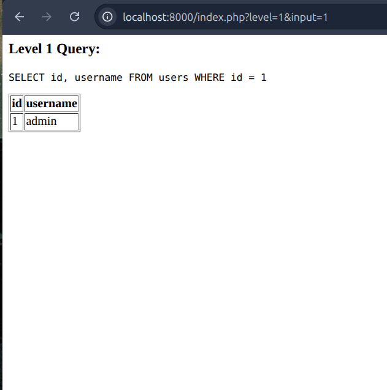

# Advanced SQL Injection Lab - TryHackMe

A hands-on cybersecurity training laboratory covering five SQL injection techniques through progressive challenges.

## 🎯 Overview

This lab provides intermediate learners with practical experience in:
- Union-based data extraction
- Blind boolean inference
- Error-based information disclosure
- Time-based blind exfiltration
- Tautology authentication bypass

**Estimated Completion Time:** 50 minutes  
**Difficulty:** Intermediate  
**Technologies:** PHP 8.2, MySQL 5.7, Docker

## 🚀 Quick Start
```bash
# Clone the repository
git clone https://github.com/AdithyaNaikk/tryhackme-sqli-lab.git
cd tryhackme-sqli-lab

# Start the lab
docker-compose up --build

# Access the application
open http://localhost:8000
```

## 📚 Documentation

- **[GUIDE.md](GUIDE.md)** - Complete challenge walkthrough with hints and verification
- **[REPORT.md](REPORT.md)** - Detailed project report covering design, testing, and outcomes

## 🎓 Learning Objectives

- Master manual SQL injection payload crafting
- Understand different injection types and contexts
- Develop critical thinking for vulnerability analysis
- Practice ethical penetration testing methodologies

## 🛠️ Lab Structure

5 progressive challenges with increasing difficulty:

1. **Challenge 1:** Union-Based Extraction (Easy - 3-5 min)
2. **Challenge 2:** Blind Boolean Inference (Medium - 10-15 min)
3. **Challenge 3:** Error-Based Disclosure (Medium - 6-10 min)
4. **Challenge 4:** Time-Based Exfiltration (Hard - 15-20 min)
5. **Challenge 5:** Authentication Bypass (Hard - 8-12 min)

## 📸 Screenshots



See all verification screenshots in the [screenshots](screenshots/) directory.

## ⚠️ Disclaimer

This lab is for **educational purposes only**. Use only in authorized testing environments. Never attempt SQL injection on systems without explicit permission.

## 👤 Author

**Adithya Naik**  
- GitHub: [@AdithyaNaikk](https://github.com/AdithyaNaikk)
- Email: naikadithya904@gmail.com

## 📝 License

MIT License - Educational use permitted

---

**Built for:** TryHackMe | **Date:** November 23, 2025